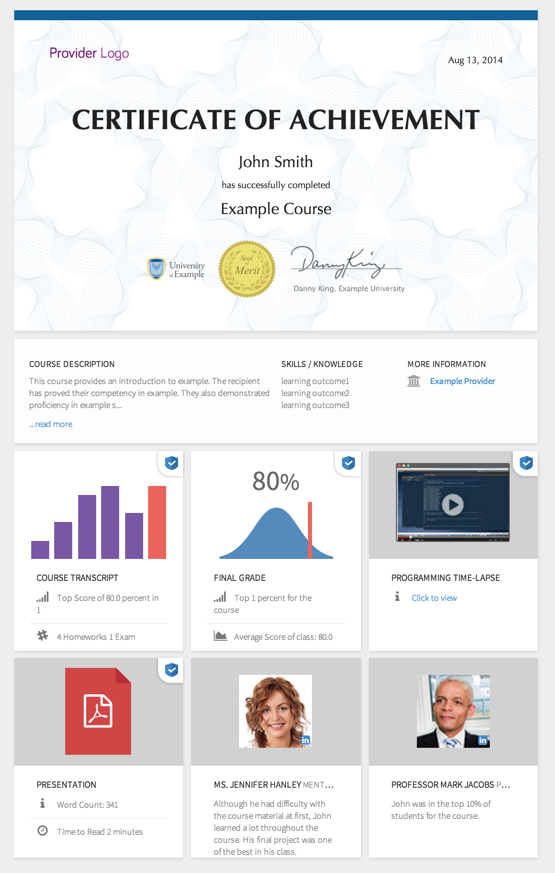

#Accredible Certificates
Contributors: accredible 
Tags: certificate, online course, lms 
Requires at least: 3.0.1 
Tested up to: 4.0 
Stable tag: 0.1.3
License: GPLv2 or later 
License URI: http://www.gnu.org/licenses/gpl-2.0.html 

This plugin allows you to issue dynamic, digital certificates for online learning courses. It can issue certificates for Wordpress sites that make use of the Academy Theme.

## Description

This module enables you to issue dynamic, digital certificates for free using the Accredible API on your Wordpress instance. They act as a replacement for the PDF certificates normally generated for your courses. An example output certificate can be viewed at: [https://accredible.com/example](https://accredible.com/example).

Currently the plugin is only compatible with Academy Theme.

## Installation

1. Visit https://accredible.com to obtain a free API key
2. Ensure you have the Wordpress Academy Theme active
3. Install the plugin
4. Activate the plugin through the 'Plugins' menu in WordPress
5. Go to the plugin settings and input your API key

## How to use

Note: By default your Accredible account is in Sandbox mode and any certificates you create will need to be manually published via the Accredible API Dashboard before being emailed to students.

### Manually creating certificates
1. Go to the 'Certificates' page in the Wordpress admin menu
2. On the list of your courses and students, select which students you would like to issue certificates to
3. Click 'Create Certificates'

### Automatically creating certificates
1. Go to the plugin settings and check 'Automatically Issue Certificate upon Course Completition'
2. When a user completed a course they will be automatically issued a certificate

## Frequently Asked Questions

#### How do I get an API key?

Visit https://accredible.com to obtain a free API key.

## Screenshots

## Changelog

#### 0.1.3
Pass through course link on certificate creation.

#### 0.1.2
Add course completion to certificates table.

#### 0.1.1
Bug fixes

#### 0.1.0
Initial version.